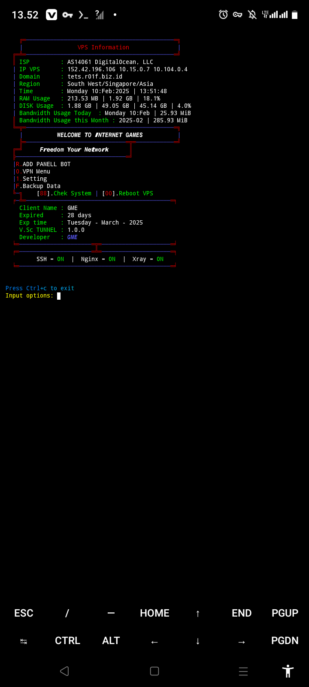

# 🚀 **R01FInject**  

  

## 🌟 **Fitur Utama**  
✅ **Manajemen server berbasis terminal** dengan Python3 dan Bash  
✅ Dukungan **Xray & SSH** untuk tunneling dan VPN  
✅ **Nginx** sebagai reverse proxy untuk keamanan & performa tinggi  
✅ **Apache** sebagai web server untuk OpenClash  
✅ Otomatisasi dengan **skrip Python & Bash**  
✅ **Rilis awal** dengan fitur dasar yang bisa dikembangkan lebih lanjut  
✅ **Backup Data** Menggunakan Mega cloud Untuk menyimpan Data user

## 📌 **Status Pengembangan**  
⚠️ Proyek ini masih dalam tahap awal pengembangan. Beberapa fitur yang sedang dikerjakan:  
- [ ] **Dashboard berbasis Bot Tele & Wa** untuk manajemen lebih mudah  
- [ ] **Dukungan database** untuk menyimpan konfigurasi  
- [ ] **Skrip otomatisasi tambahan** untuk manajemen Xray  
- [ ] **Dokumentasi lebih lengkap**  
- [ ] **Performa Untuk kenyamann pengunaan**

Kami sangat terbuka untuk kontribusi! Jika ingin membantu, silakan gabung di komunitas untuk diskusi dll,  

## 📸 **Tangkapan Layar**  

## 🛠 **Teknologi yang Digunakan**  
- 🐍 **[Python3](https://www.python.org/)** - Backend utama untuk manajemen server  
- ⚡ **[Xray](https://github.com/XTLS/Xray-core)** - Tunneling & VPN  
- 🌐 **[Nginx](https://nginx.org/)** - Reverse Proxy untuk meningkatkan keamanan dan performa  
- 🏗️ **[Apache](https://httpd.apache.org/)** - Web server untuk OpenClash  
- 🔧 **Bash Scripting** - Untuk otomatisasi tugas server  
- 📦 **Open Source** - Bebas digunakan dan dikembangkan  

## 🖥️ **Pengelolaan via Terminal**  
Semua pengaturan dan konfigurasi dapat dilakukan langsung dari terminal menggunakan **Python3 dan Bash**. Sistem ini dirancang agar ringan dan fleksibel, tanpa antarmuka grafis yang berat.  

## ⚠️ **Persyaratan Sistem**  
✅ **OS**: Debian 11 / 10  
✅ **Akses**: Root diperlukan  
✅ **Dependency**: Python3, Nginx, Apache, Xray, ssh openvpn,

## 🎯 **Roadmap**  
✅ **Rilis awal** dengan fitur dasar  
🚧 Penambahan database untuk menyimpan konfigurasi  
🔜 Dashboard berbasis web untuk manajemen lebih mudah  

## 📜 **Status & Lisensi**  
🔓 **Open Source** - Proyek ini gratis digunakan dan dikembangkan oleh komunitas.  
📄 **Lisensi**: Menggunakan **MIT License**.  

## 👥 **Bergabung dengan Komunitas**  
🔹 **Discord**: [Join Server](https://discord.gg/example)  
🔹 **Telegram**: [Bergabung](https://t.me/example)  

## ☕ **Dukung Pengembangan Proyek**  
Proyek ini dikembangkan secara gratis dan open-source. Jika kamu ingin mendukung pengembangan lebih lanjut, kamu bisa memberikan donasi melalui:  

💰 **Saweria**: [Donate via Saweria](https://saweria.co/example)  

Dukungan dari kamu sangat membantu untuk terus mengembangkan proyek ini! ❤️  

📌 **Jangan lupa beri bintang ⭐ Dan ikuti Github ini jika suka dengan proyek ini!**
